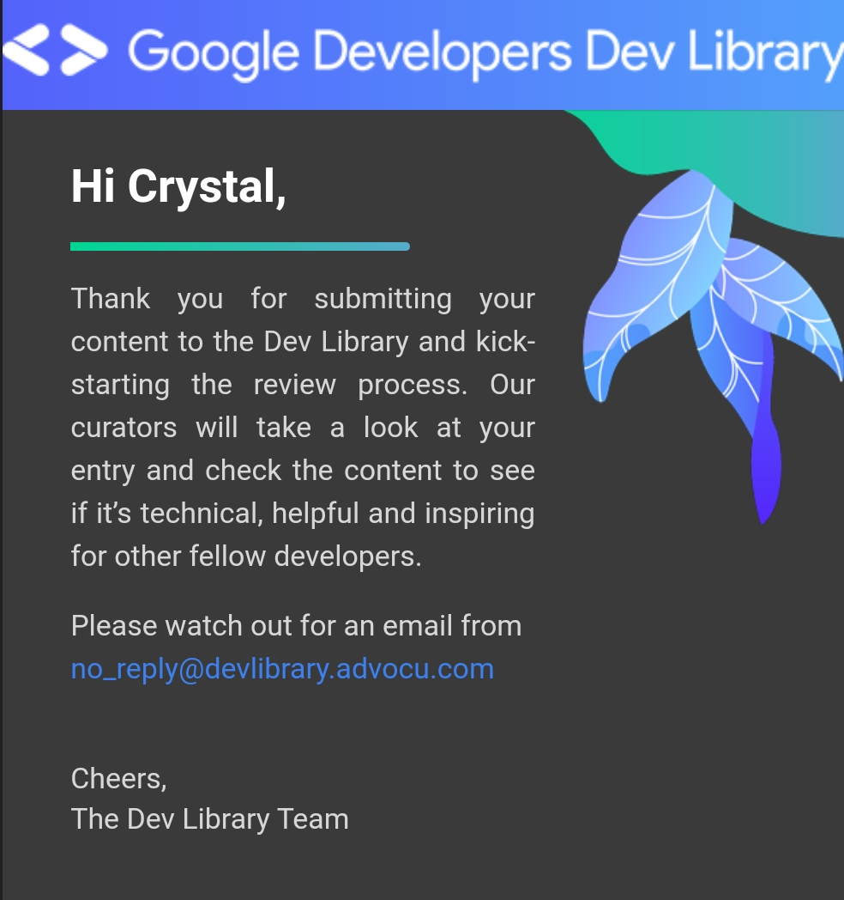

<h1>Karen - The Summariser</h1>
<h3>I will summarise any Article , News , Blog in text. All you have to do is just provide me a valid URL.😇</h3>
<h3>To make this much simpler, We have created Whatsapp Bot with TWILIO 🌟 Tool Click the link to join the Bot.</h3>
<a href="https://wa.me/+14155238886?text=Join%20sun-determine">Click here to get Whatsapp Bot</a>
<h3>Also created a website in flask framework and deployed in DigitalOcean</h3>
<a href="https://karen-cloud-native-hackathon-ps64n.ondigitalocean.app/">Click here to reach website</a>

<h3>How I used Twilio</h3>
I used Twilio to create a whatsapp Bot using Whatsapp Sandbox and linked to my web application. When the link received it will perfom Natural Language Processing Algorithm to summarise the whole webpage and send to you.
Thank you for the support from Twilio team and cloud native hackathon team.

Visit WhatsappBot github

<a href="https://github.com/crystal-kishore/WhatsappBot">WhatsappBot</a>

<h3>How to Use</h3>
Send Hi for the introduction
Send Join sun-determine to activate the bot.
Send valid URL to summarise the webPage.

<h3>How Summarisation works:</h3>
I used punkt module from nltk package , its an opensource library we can use it by importing punkt module from nltk
Link for punkt module :
<a href="https://github.com/nltk/nltk/blob/develop/nltk/tokenize/punkt.py">Punkt library</a>
<h3>I also made a blog on Google Dev Library : under verification</h3>

